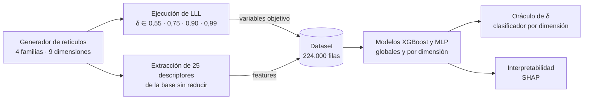

# Predicción con ML de la calidad de reducción de retículos y oráculo adaptativo de δ

> **Trabajo Fin de Grado** · Grado en Ingeniería Informática · Universidad Carlos III de Madrid (2025–2026)
> Aprendizaje automático supervisado e interpretabilidad (SHAP) aplicados al criptoanálisis de retículos

[](https://www.python.org/)
[-green.svg)](https://xgboost.readthedocs.io/)
[](https://pytorch.org/)
[](https://shap.readthedocs.io/)

📄 **[Memoria completa del TFG (PDF)](./docs/Memoria_TFG_ML_Lattice_Reduction.pdf)**

---

## En resumen

La criptografía post-cuántica estandarizada por el NIST en 2024 (ML-KEM, ML-DSA) basa su seguridad en lo costoso que es reducir bases de retículo con algoritmos como **LLL** y **BKZ**. Los métodos actuales para estimar ese coste son demasiado conservadores (cotas del peor caso), insensibles a la instancia concreta (heurística Gaussiana) o caros (ejecutar el algoritmo).

Este proyecto construye un sistema de **machine learning supervisado** que predice la calidad de la reducción LLL **a partir únicamente de la base sin reducir, sin ejecutar el algoritmo**. Sobre esas predicciones se construye un **oráculo** que elige, para cada base, el parámetro δ de LLL más conveniente, ahorrando tiempo de cómputo sin perder calidad apreciable.

---

## Resultados principales

| Tarea | Modelo | Resultado (conjunto de test, bases no vistas) |
| :--- | :--- | :--- |
| Predecir el defecto de ortogonalidad | XGBoost global | **R² ≈ 0,9997** |
| Predecir la norma del primer vector reducido | XGBoost global | **R² ≈ 0,98** |
| Predecir el root Hermite factor (rhf) | XGBoost por dimensión | **MAE entre un 25 % y un 50 % menor** que el modelo global sobre las mismas bases; R² agregado > 0,99 para d ≥ 100 (ver nota) |
| Seleccionar δ por base (τ = 0) | XGBClassifier por dimensión | δ < 0,99 en el **36,6 %** de las bases, con una degradación media de calidad de **+0,123 %**. Exactitud del 59,8 % (baseline: 53,0 %); el 89,9 % de las predicciones acierta o falla por una sola clase adyacente |
| Ahorro de tiempo real | Oráculo sobre 480 bases nuevas | Aceleración mediana de **≈ 1,23–1,28×** en d = 120 (familias uniforme, gaussiana y sparse); marginal (≈ 1,0–1,09×) en d ≤ 100 |

> **Nota sobre el R² del rhf.** El R² agregado por dimensión incluye la varianza *entre* familias de retículos, que el modelo explica con facilidad. Fijando dimensión y familia, el R² del rhf baja a 0,59–0,73 en las familias uniforme, gaussiana y sparse. Por eso la mejora de la especialización por dimensión se mide principalmente con el error absoluto (MAE). El análisis completo está en la Sección 4.5 de la memoria.

<!-- Recomendado: añade aquí 1 o 2 figuras de graphs/, por ejemplo la importancia SHAP y la aceleración del oráculo:

-->

---

## Cómo funciona



1. **Generación de datos.** 56.000 bases de cuatro familias (uniforme, gaussiana, sparse y q-aria) en nueve dimensiones (d = 10 a 200). Cada base se reduce con cuatro valores de δ usando [fpylll](https://github.com/fplll/fpylll), lo que da 224.000 filas. La generación está paralelizada con `multiprocessing` y tarda unos 37 minutos en 12 hilos.
2. **Features.** 25 descriptores algebraicos y geométricos calculados sobre la base *antes* de reducirla, agrupados en cinco bloques: magnitudes globales, normas de los vectores, perfil de Gram-Schmidt y su ajuste log-lineal, funcionales del perfil (masa, entropía y producto de adyacencia) y medidas de ortogonalidad y condicionamiento.
3. **Modelos.** Tres variables objetivo de calidad: defecto de ortogonalidad, norma del primer vector reducido y root Hermite factor. Se comparan XGBoost (random forest y gradient boosting, acelerados en GPU) y redes MLP en PyTorch, con dos estrategias: un modelo global y un modelo por dimensión.
4. **Oráculo de δ.** Un clasificador por dimensión predice directamente el δ más pequeño que no empeora la calidad respecto al óptimo.
5. **Interpretabilidad.** Valores de Shapley (SHAP) para entender qué propiedades de la base determinan cada predicción.

---

## Decisiones técnicas destacadas

**Partición sin fugas de información.** Cada base genera cuatro filas (una por δ). La división train/test (80/20) se hace por base y no por fila, estratificada por dimensión y familia. La partición se fija una sola vez (`splits/canonical_test_base_ids.csv`) y la comparten todos los experimentos: modelos globales, por dimensión, MLP y oráculo.

**Modelo global frente a modelo por dimensión.** El rhf varía poco dentro de cada dimensión y mucho entre dimensiones, por lo que un modelo único lo predice mal (R² ≈ 0,75). Especializar un modelo por dimensión reduce el error absoluto entre un 25 % y un 50 % sobre las mismas bases de test. El modelo global se conserva como fallback para dimensiones no vistas.

**XGBoost frente a redes neuronales.** Los MLP en PyTorch obtienen resultados equivalentes en la mayor parte del rango (diferencias de R² < 0,01), pero se degradan en el rhf a partir de d = 100, donde XGBoost se mantiene estable. Por eso el sistema final usa XGBoost por dimensión.

**De un primer enfoque fallido a la reformulación del oráculo.** La primera versión predecía el rhf para cada δ y elegía con una regla de umbral. Fracasó: acabó eligiendo casi siempre δ = 0,55, con un 8,1 % de exactitud frente al 53,0 % de la estrategia trivial "siempre δ = 0,99". El diagnóstico mostró que no era un error de implementación, sino una propiedad del problema: las diferencias de rhf entre valores de δ para una misma base son del orden del error del propio regresor. La solución fue **reformular la selección como clasificación supervisada** (XGBClassifier), llevando el umbral de tolerancia τ a la definición del objetivo de entrenamiento.

**Qué aprenden realmente los modelos (SHAP).** Los modelos no reconstruyen las fórmulas que definen cada métrica, sino que aprenden propiedades geométricas de la base. El defecto de ortogonalidad se explica sobre todo por la fracción de coeficientes de Gram-Schmidt con |μ| > 0,5, que mide cuánto se aleja la base de la condición de *size-reduction* de LLL. La norma del primer vector reducido depende sobre todo de δ y de la norma mínima de la base original, y no de la ley volumétrica de la heurística Gaussiana, cuya forma fuerte no se sostiene en este conjunto de datos.

---

## Limitaciones

- **Retículos q-arios simplificados.** La familia q-aria usa q = 101 y una matriz aleatoria sin estructura de anillo. Modela geométricamente el problema LWE en su forma plana, pero **no reproduce ML-KEM ni ML-DSA**, que usan Module-LWE con módulos y dimensiones mucho mayores. Sobre estos retículos el oráculo apenas se aparta de δ = 0,99, por lo que no degrada su calidad, aunque tampoco produce ahorro de tiempo.
- **Rango dimensional.** Se estudia d ≤ 200, por debajo de las dimensiones criptográficamente relevantes (512 y 768 en ML-KEM).
- **Ahorro de tiempo modesto.** Solo es claro en d = 120 y depende de la familia de retículos.
- **Transferibilidad no evaluada** a otras familias, como los retículos NTRU.

**Trabajo futuro:** usar el número de intercambios (swaps) de LLL como variable objetivo para optimizar directamente el coste, extender el enfoque a BKZ y escalar a dimensiones mayores.

---

## Stack tecnológico

- **Lenguaje:** Python 3.12
- **Machine learning:** XGBoost (GPU, CUDA 12.4), scikit-learn, PyTorch (MLP)
- **Datos y visualización:** NumPy, pandas, Matplotlib
- **Interpretabilidad:** SHAP
- **Retículos:** fpylll (bindings de fplll)
- **Entorno y reproducibilidad:** Conda, Jupyter, WSL2 (Ubuntu 24.04), semillas fijas, hash SHA-256 del dataset

---

## Estructura del repositorio

```
ML_lattice_cryptanalysis/
├── lattice_dataset_v2.zip           # Dataset congelado (vía recomendada)
├── gen_features_and_target.py       # Generación del dataset y extracción de features
├── lattice_utils.py                 # Generadores de retículos (facilitados por el tutor) y funcionales GSO
├── split_utils.py                   # Partición canónica entrenamiento/prueba
├── environment.yml                  # Dependencias Conda
├── dim_models.ipynb                 # Modelos XGBoost por dimensión (principal)
├── dim_mlps.ipynb                   # MLP por dimensión (comparativa)
├── oracle.ipynb                     # Oráculo de selección de δ
├── models/
│   ├── per_dim/                     # Modelos XGBoost serializados
│   └── mlp_per_dim/                 # Modelos MLP por dimensión
├── splits/
│   └── canonical_test_base_ids.csv  # Bases del conjunto de test
└── graphs/                          # Figuras generadas
```

Los generadores de retículos de `lattice_utils.py` fueron facilitados por el tutor. El resto del pipeline (extracción de características, etiquetado, entrenamiento, evaluación y oráculo) es de elaboración propia.

---

## Cómo reproducir los resultados

Ejecuta los pasos en este orden desde la raíz del repositorio.

### 1. Crear el entorno

```bash
conda env create -f environment.yml
conda activate delta_predictor_release
```

### 2. Obtener el dataset

**Vía recomendada: dataset congelado.** Es el que sustenta todas las cifras de la memoria.

```bash
unzip lattice_dataset_v2.zip
sha256sum lattice_dataset_v2.csv
# esperado: d3e5a9d8a50ec188e6246703d72d20d548d5bfaeba067f6fc264eb75e48d949c
```

En Windows (PowerShell): `Expand-Archive lattice_dataset_v2.zip .` y `Get-FileHash lattice_dataset_v2.csv -Algorithm SHA256`.

**Vía alternativa: regenerarlo desde cero** (unos 35 minutos en CPU con todos los núcleos).

```bash
python gen_features_and_target.py
```

La regeneración es determinista: un generador maestro asigna una semilla a cada tarea antes de paralelizar, así que el resultado es idéntico entre ejecuciones con independencia del número de núcleos. Sin embargo, el dataset congelado se generó antes de introducir este esquema de semillas, por lo que la regeneración produce un conjunto **distinto pero estadísticamente equivalente**. Para reproducir las cifras exactas de la memoria, usa el dataset congelado.

### 3. Modelos XGBoost por dimensión

Ejecuta todas las celdas de `dim_models.ipynb` (unos 10 minutos con GPU).
Genera `models/per_dim/gb_*.pkl`, `scaler_*.pkl` y `xgb_results.json` con las métricas R² y MAE.

### 4. MLP por dimensión

Requiere el paso 3. Ejecuta todas las celdas de `dim_mlps.ipynb` (unos 30 minutos con GPU).
Genera `models/mlp_per_dim/{target}_d{d}.pt` (27 modelos) y `graphs/mlp_all_targets.png`.

### 5. Oráculo de δ

Requiere el paso 3. Ejecuta todas las celdas de `oracle.ipynb` (unos 5 minutos).
Genera las tablas de exactitud y aceleración por familia de retículo y dimensión.

### Notas

- **Sin GPU:** cambia `device='cuda'` por `device='cpu'` en los notebooks que lo usen. El entrenamiento será bastante más lento.
- **Variación esperada:** diferencias de ±0,01 en R² entre ejecuciones son normales por el no determinismo de las operaciones en coma flotante en GPU y no alteran las conclusiones.
- **Semillas:** `SEED = 42` en todos los componentes (dataset, partición, NumPy y PyTorch).

---

## Autor

**Fernando Martín Arencibia** · Graduado en Ingeniería Informática por la Universidad Carlos III de Madrid

[LinkedIn](https://www.linkedin.com/in/fernando-martin-arencibia-477257368/) · [GitHub](https://github.com/fernandomartinarencibia) · [Email](mailto:fernandomartinarencibia@gmail.com)

Tutor: Francisco Javier Blanco Romero (Departamento de Informática, UC3M), a quien agradezco su orientación y apoyo técnico y que también es autor de lattice_utils.py fundamental para la generación de las bases.

## Licencia

La memoria se distribuye bajo licencia Creative Commons Reconocimiento - No Comercial - Sin Obra Derivada.