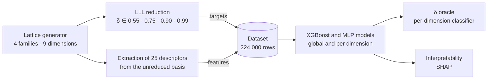

# ML Prediction of Lattice Reduction Quality and an Adaptive δ Oracle

> **Bachelor's Thesis** · BSc in Computer Science and Engineering · Universidad Carlos III de Madrid (2025–2026)
> Supervised machine learning and interpretability (SHAP) applied to lattice cryptanalysis

**Language:** English · [Español](./README.es.md)

[](https://www.python.org/)
[-green.svg)](https://xgboost.readthedocs.io/)
[](https://pytorch.org/)
[](https://shap.readthedocs.io/)

📄 **[Full thesis (PDF, in Spanish)](./Memoria_TFG_ML_Lattice_Reduction.pdf)**

---

## Overview

The post-quantum cryptography standardised by NIST in 2024 (ML-KEM, ML-DSA) relies on how hard it is to reduce lattice bases with algorithms such as **LLL** and **BKZ**. Current ways of estimating that cost are either too conservative (worst-case bounds), blind to the specific instance (the Gaussian heuristic), or expensive (running the algorithm itself).

This project builds a **supervised machine learning** system that predicts the quality of an LLL reduction **from the unreduced basis alone, without running the algorithm**. On top of these predictions, an **oracle** picks the most suitable LLL parameter δ for each basis, saving compute time with no appreciable loss of quality.

---

## Key results

| Task | Model | Result (test set, unseen bases) |
| :--- | :--- | :--- |
| Predict the orthogonality defect | Global XGBoost | **R² ≈ 0.9997** |
| Predict the norm of the first reduced vector | Global XGBoost | **R² ≈ 0.98** |
| Predict the root Hermite factor (rhf) | Per-dimension XGBoost | **25–50% lower MAE** than the global model on the same bases; aggregate R² > 0.99 for d ≥ 100 (see note) |
| Select δ per basis (τ = 0) | Per-dimension XGBClassifier | δ < 0.99 for **36.6%** of bases, with a mean quality degradation of **+0.123%**. Accuracy 59.8% (baseline: 53.0%); 89.9% of predictions are correct or off by a single adjacent class |
| Real runtime savings | Oracle on 480 fresh bases | Median speed-up of **≈ 1.23–1.28×** at d = 120 (uniform, Gaussian and sparse families); marginal (≈ 1.0–1.09×) for d ≤ 100 |

> **A note on the rhf R².** The aggregate per-dimension R² includes the variance *between* lattice families, which the model explains easily. With dimension and family fixed, the rhf R² drops to 0.59–0.73 for the uniform, Gaussian and sparse families. This is why the benefit of per-dimension specialisation is measured mainly through absolute error (MAE). The full analysis is in Section 4.5 of the thesis.

<!-- Recommended: add 1 or 2 figures from graphs/ here, e.g. SHAP importance and oracle speed-up:

-->

---

## How it works



1. **Data generation.** 56,000 bases from four families (uniform, Gaussian, sparse and q-ary) across nine dimensions (d = 10 to 200). Each basis is reduced with four values of δ using [fpylll](https://github.com/fplll/fpylll), giving 224,000 rows. Generation is parallelised with `multiprocessing` and takes about 37 minutes on 12 threads.
2. **Features.** 25 algebraic and geometric descriptors computed on the basis *before* reduction, grouped into five blocks: global magnitudes, basis vector norms, the Gram-Schmidt profile and its log-linear fit, profile functionals (mass, entropy and adjacency product), and orthogonality and conditioning measures.
3. **Models.** Three quality targets: orthogonality defect, norm of the first reduced vector, and root Hermite factor. XGBoost (random forest and gradient boosting, GPU-accelerated) is compared against MLPs in PyTorch, under two strategies: a single global model and one model per dimension.
4. **δ oracle.** A per-dimension classifier directly predicts the smallest δ that does not degrade quality relative to the optimum.
5. **Interpretability.** Shapley values (SHAP) reveal which properties of the basis drive each prediction.

---

## Key technical decisions

**Leakage-free split.** Each basis produces four rows (one per δ). The 80/20 train/test split is done by basis rather than by row, stratified by dimension and family. The split is fixed once (`splits/canonical_test_base_ids.csv`) and shared by every experiment: global models, per-dimension models, MLPs and the oracle.

**Global vs per-dimension models.** The rhf varies little within a dimension but a lot across dimensions, so a single model predicts it poorly (R² ≈ 0.75). Training one model per dimension cuts absolute error by 25–50% on the same test bases. The global model is kept as a fallback for unseen dimensions.

**XGBoost vs neural networks.** The PyTorch MLPs match XGBoost across most of the range (R² differences < 0.01) but degrade on the rhf from d = 100 onwards, where XGBoost stays stable. The final system therefore uses per-dimension XGBoost.

**From a failed first approach to a reformulated oracle.** The first version predicted the rhf for each δ and chose using a threshold rule. It failed: it ended up choosing δ = 0.55 almost every time, with 8.1% accuracy against 53.0% for the trivial "always δ = 0.99" strategy. Diagnosis showed this was not an implementation bug but a property of the problem: for a given basis, the rhf differences between δ values are of the same order as the regressor's own error. The fix was to **reformulate selection as supervised classification** (XGBClassifier), moving the tolerance threshold τ into the definition of the training target.

**What the models actually learn (SHAP).** The models do not reconstruct the formulas that define each metric; instead they learn geometric properties of the basis. The orthogonality defect is explained mainly by the fraction of Gram-Schmidt coefficients with |μ| > 0.5, which measures how far the basis is from LLL's size-reduction condition. The norm of the first reduced vector depends mainly on δ and on the minimum norm of the original basis, rather than on the volumetric law of the Gaussian heuristic, whose strong form does not hold on this dataset.

---

## Limitations

- **Simplified q-ary lattices.** The q-ary family uses q = 101 and an unstructured random matrix. It is a geometric model of plain LWE, but it **does not reproduce ML-KEM or ML-DSA**, which use Module-LWE with much larger moduli and dimensions. On these lattices the oracle rarely moves away from δ = 0.99, so it does not degrade their quality, but it does not save time either.
- **Dimension range.** The study covers d ≤ 200, below cryptographically relevant dimensions (512 and 768 in ML-KEM).
- **Modest time savings.** They are clear only at d = 120 and depend on the lattice family.
- **Transferability not evaluated** to other families, such as NTRU lattices.

**Future work:** use the number of LLL swaps as a target to optimise cost directly, extend the approach to BKZ, and scale to higher dimensions.

---

## Tech stack

- **Language:** Python 3.12
- **Machine learning:** XGBoost (GPU, CUDA 12.4), scikit-learn, PyTorch (MLP)
- **Data and visualisation:** NumPy, pandas, Matplotlib
- **Interpretability:** SHAP
- **Lattices:** fpylll (Python bindings for fplll)
- **Environment and reproducibility:** Conda, Jupyter, WSL2 (Ubuntu 24.04), fixed seeds, SHA-256 dataset hash

---

## Repository structure

```
ML_lattice_cryptanalysis/
├── lattice_dataset_v2.zip           # Frozen dataset (recommended route)
├── gen_features_and_target.py       # Dataset generation and feature extraction
├── lattice_utils.py                 # Lattice generators (provided by the supervisor) and GSO functionals
├── split_utils.py                   # Canonical train/test split
├── environment.yml                  # Conda dependencies
├── dim_models.ipynb                 # Per-dimension XGBoost models (main)
├── dim_mlps.ipynb                   # Per-dimension MLPs (comparison)
├── oracle.ipynb                     # δ selection oracle
├── models/
│   ├── per_dim/                     # Serialised XGBoost models
│   └── mlp_per_dim/                 # Per-dimension MLP models
├── splits/
│   └── canonical_test_base_ids.csv  # Test set bases
└── graphs/                          # Generated figures
```

The lattice generators in `lattice_utils.py` were provided by my supervisor. The rest of the pipeline (feature extraction, labelling, training, evaluation and the oracle) is my own work.

---

## Reproducing the results

Run these steps in order from the repository root.

### 1. Create the environment

```bash
conda env create -f environment.yml
conda activate delta_predictor_release
```

### 2. Get the dataset

**Recommended: the frozen dataset.** All figures in the thesis are based on it.

```bash
unzip lattice_dataset_v2.zip
sha256sum lattice_dataset_v2.csv
# expected: d3e5a9d8a50ec188e6246703d72d20d548d5bfaeba067f6fc264eb75e48d949c
```

On Windows (PowerShell): `Expand-Archive lattice_dataset_v2.zip .` and `Get-FileHash lattice_dataset_v2.csv -Algorithm SHA256`.

**Alternative: regenerate it from scratch** (about 35 minutes on CPU using all cores).

```bash
python gen_features_and_target.py
```

Regeneration is deterministic: a master generator assigns a seed to each task before parallelisation, so the output is identical across runs regardless of the number of cores. However, the frozen dataset was generated before this seeding scheme was introduced, so regeneration produces a **different but statistically equivalent** dataset. To reproduce the exact figures in the thesis, use the frozen dataset.

### 3. Per-dimension XGBoost models

Run all cells in `dim_models.ipynb` (about 10 minutes with a GPU).
Produces `models/per_dim/gb_*.pkl`, `scaler_*.pkl` and `xgb_results.json` with R² and MAE metrics.

### 4. Per-dimension MLPs

Requires step 3. Run all cells in `dim_mlps.ipynb` (about 30 minutes with a GPU).
Produces `models/mlp_per_dim/{target}_d{d}.pt` (27 models) and `graphs/mlp_all_targets.png`.

### 5. δ oracle

Requires step 3. Run all cells in `oracle.ipynb` (about 5 minutes).
Produces accuracy and speed-up tables broken down by lattice family and dimension.

### Notes

- **No GPU:** change `device='cuda'` to `device='cpu'` in the notebooks that use it. Training will be considerably slower.
- **Expected variation:** R² differences of ±0.01 between runs are normal due to non-deterministic floating-point operations on the GPU and do not affect the conclusions.
- **Seeds:** `SEED = 42` everywhere (dataset, split, NumPy and PyTorch).

---

## Author

**Fernando Martín Arencibia** · BSc in Computer Science and Engineering, Universidad Carlos III de Madrid

[LinkedIn](https://www.linkedin.com/in/fernando-martin-arencibia-477257368/) · [GitHub](https://github.com/fernandomartinarencibia) · [Email](mailto:fernandomartinarencibia@gmail.com)

Supervisor: Francisco Javier Blanco Romero (Department of Computer Science, UC3M), whom I thank for his guidance and technical support.

## License

The thesis is distributed under a Creative Commons Attribution-NonCommercial-NoDerivatives licence. [State the code licence here, e.g. MIT, after confirming with your supervisor regarding the code in `lattice_utils.py`.]